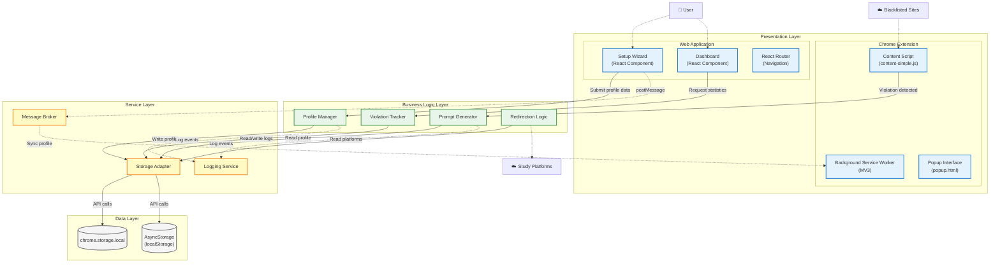
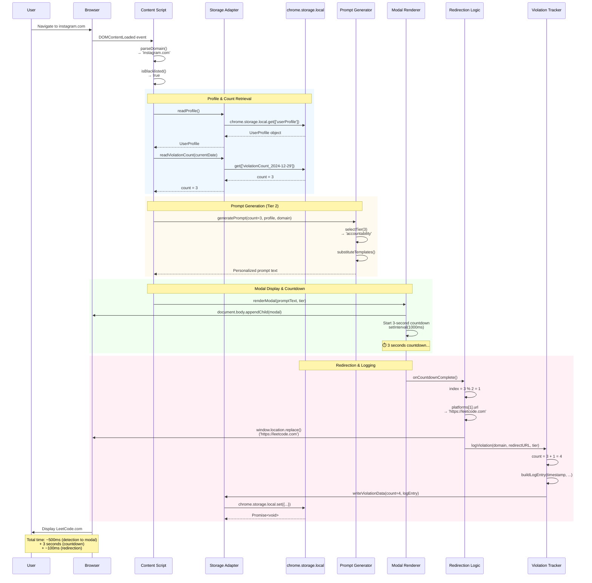
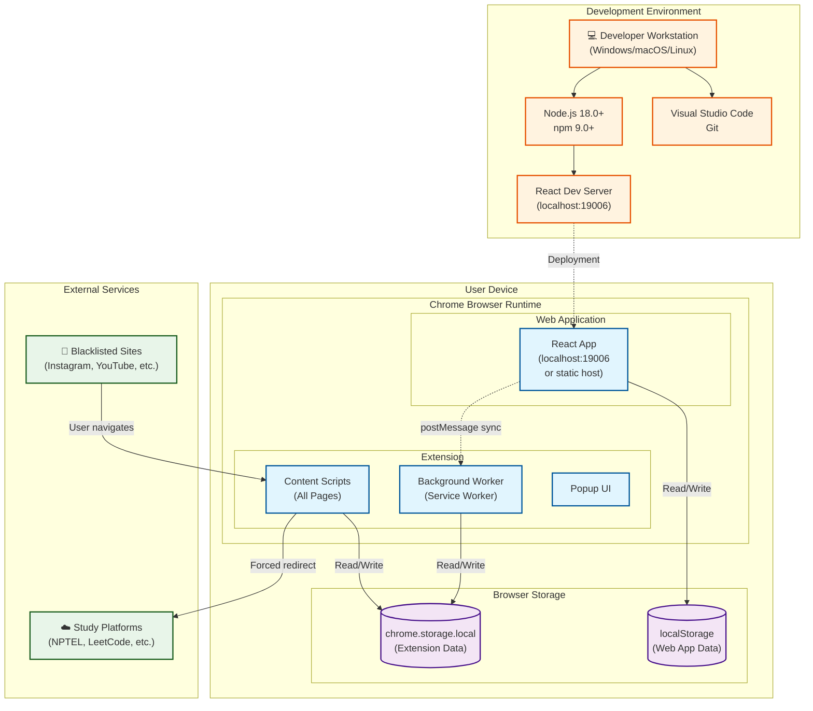
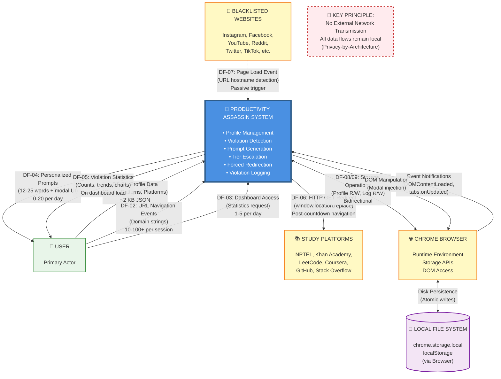
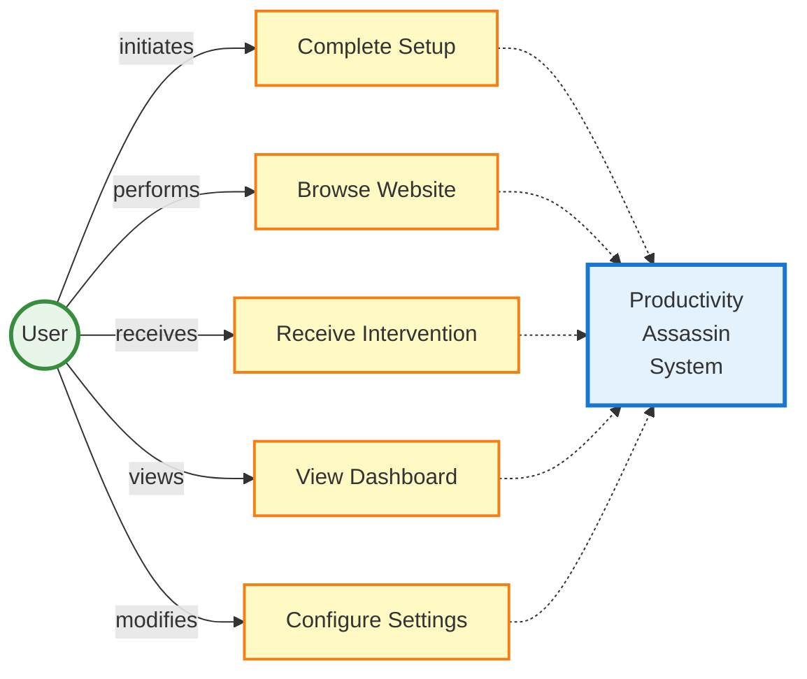
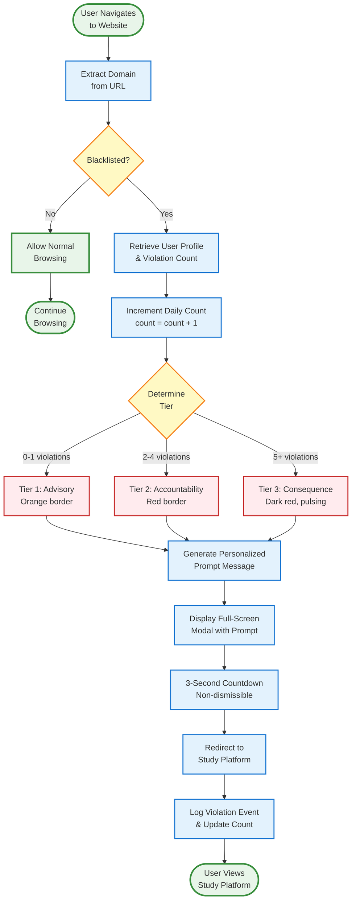
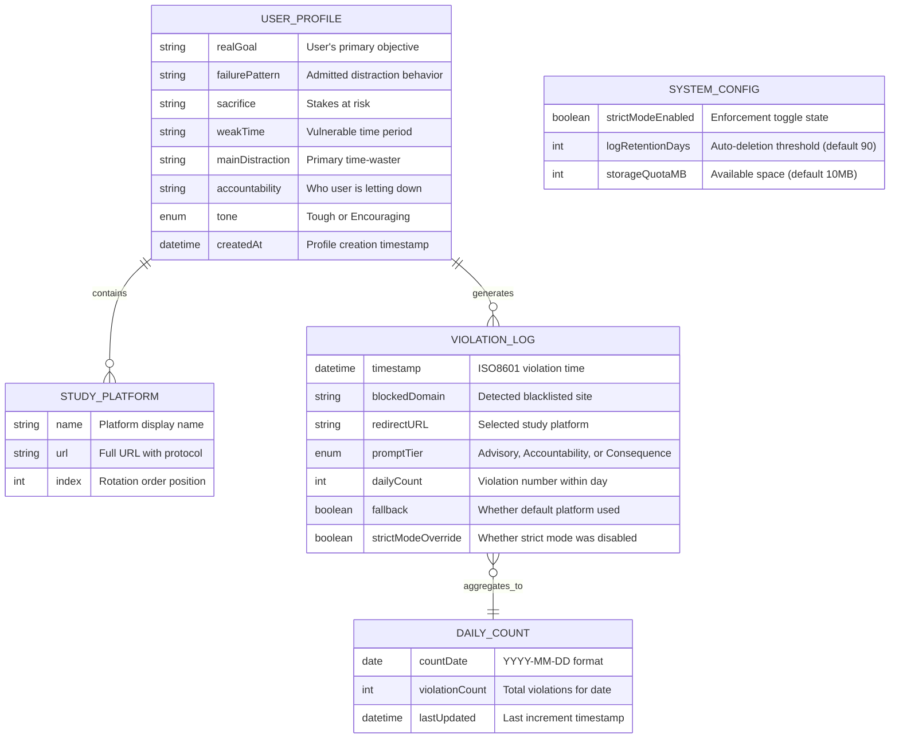

# Mermaid Diagrams for System Design Section

This file contains Mermaid code for all three figures in Section 5 (System Design).

---

## Figure 5.1: Four-Tier Layered Architecture



**Caption for Figure 5.1:**  
Four-tier layered architecture of the Productivity Assassin system. The Presentation Layer comprises React-based web application and Chrome Manifest V3 extension components. Business Logic Layer implements prompt generation, tier selection, and violation tracking algorithms. Service Layer abstracts storage operations and inter-component messaging. Data Layer manages persistent storage via browser APIs. Solid arrows represent synchronous function calls; dashed arrows represent asynchronous message passing.

---

## Figure 5.2: Violation Detection and Intervention Sequence Diagram



**Caption for Figure 5.2:**  
Sequence diagram depicting data flow during a violation intervention. Vertical lifelines represent system components; horizontal arrows represent synchronous function calls (solid) and asynchronous operations (dashed). Numbered sequence: (1) User navigates to blacklisted URL, (2) Content script extracts domain and performs blacklist match, (3) Profile and violation count retrieved from chrome.storage, (4) Prompt generator computes tier and message text, (5) Modal rendered with 3-second countdown, (6) Redirection logic selects platform via modulo rotation, (7) Browser navigates to study platform, (8) Violation tracker increments count and creates log entry, (9) Updated data persisted to storage.

---

## Figure 5.3: Deployment Diagram



**Caption for Figure 5.3:**  
Deployment architecture showing development and runtime environments. Development environment executes Node.js with npm dependencies and React development server (port 19006). User device runs Chrome browser hosting both the web application (accessed via localhost URL during development, or static hosting in production) and the extension (installed via developer mode or Chrome Web Store). Browser storage persists data locally on user device; no remote servers involved in architecture.

---

## Figure 5.4: Context Flow Diagram



**Caption for Figure 5.4:**  
Context flow diagram depicting the Productivity Assassin system (central box) and external entities with which it exchanges data. Arrows indicate data flows across system boundary: User provides profile data and navigation events, system delivers prompts and statistics. Blacklisted websites trigger detection via navigation events (dashed line indicates passive detection, not active communication). Study platforms receive redirection requests post-intervention. Chrome browser provides runtime environment and storage APIs. All data persists locally via browser-managed file system; no external network transmission occurs (privacy-by-architecture principle per ADR-001).

**Data Flow Reference (see Section 5.2.2, Table 5.2):**
- **DF-01**: User → System (Profile creation, one-time ~2KB)
- **DF-02**: User → System (Navigation events, high frequency)
- **DF-03**: User → System (Dashboard access, 1-5/day)
- **DF-04**: System → User (Intervention prompts, 0-20/day)
- **DF-05**: System → User (Statistics display, dashboard load)
- **DF-06**: System → Study Platforms (Forced redirect, matches DF-04)
- **DF-07**: Blacklisted Sites → System (Page load detection, passive)
- **DF-08**: System → Browser Storage (Writes: profile, logs, counts)
- **DF-09**: Browser Storage → System (Reads: profile, logs, counts)

---

## Figure 6.1: Complete Process Flow Diagram

```mermaid
flowchart TD
    Start([User Accesses<br/>Web Application]) --> CheckProfile{Profile<br/>Exists?}
    
    CheckProfile -->|No| Setup[Display Setup Wizard<br/>Question 1/7]
    CheckProfile -->|Yes| Dashboard[Navigate to<br/>Dashboard]
    
    Setup --> Q2[Questions 2-7:<br/>Capture User Input]
    Q2 --> ValidatePlatforms{Study Platforms<br/>≥2?}
    
    ValidatePlatforms -->|No| Error1[Alert: Minimum<br/>2 platforms required]
    Error1 --> Setup
    
    ValidatePlatforms -->|Yes| ParsePlatforms[Parse Platform URLs:<br/>Add https://, Extract domain,<br/>Generate names]
    
    ParsePlatforms --> ConstructProfile[Construct UserProfile Object:<br/>7 fields + timestamp]
    
    ConstructProfile --> DualWrite[(Dual Storage Write:<br/>1. AsyncStorage<br/>2. postMessage to Extension<br/>3. chrome.storage.local)]
    
    DualWrite --> Confirm[Display Success Alert:<br/>✅ Assassin Mode Activated]
    Confirm --> Dashboard
    
    %% Monitoring Loop
    Dashboard -.-> Monitoring([User Browses Web])
    Monitoring --> PageLoad[Page Load Event:<br/>DOMContentLoaded]
    
    PageLoad --> ExtractDomain[Extract Domain:<br/>window.location.hostname<br/>→ Normalize, Strip www.]
    
    ExtractDomain --> BlacklistCheck{Domain in<br/>Blacklist?}
    
    BlacklistCheck -->|No| AllowBrowsing[Allow Normal<br/>Page Load]
    AllowBrowsing -.-> Monitoring
    
    BlacklistCheck -->|Yes| StrictMode{Strict Mode<br/>Enabled?}
    
    StrictMode -->|No| Warning[Display Warning<br/>No Redirect]
    Warning --> LogOverride[(Log with<br/>strictModeOverride: true)]
    LogOverride -.-> Monitoring
    
    StrictMode -->|Yes| ReadProfile[(Retrieve Profile &<br/>Violation Count from<br/>chrome.storage.local)]
    
    ReadProfile --> IncrementCount[Increment Count:<br/>count = count + 1]
    
    IncrementCount --> SelectTier{Count<br/>Value?}
    
    SelectTier -->|0-1| Tier1[Tier: Advisory<br/>Orange Border]
    SelectTier -->|2-4| Tier2[Tier: Accountability<br/>Red Border]
    SelectTier -->|5+| Tier3[Tier: Consequence<br/>Dark Red, Pulsing]
    
    Tier1 --> GenPrompt1[Template: '{domain} has ZERO<br/>connection to {goal}...']
    Tier2 --> GenPrompt2[Template: 'You admitted:<br/>{failurePattern}...']
    Tier3 --> GenPrompt3[Template: 'STOP LYING<br/>TO YOURSELF...']
    
    GenPrompt1 --> Substitute[Substitute Placeholders:<br/>{goal}, {domain}, {count}, etc.]
    GenPrompt2 --> Substitute
    GenPrompt3 --> Substitute
    
    Substitute --> RenderModal[Inject Full-Screen Modal:<br/>• 🚫 Icon<br/>• Personalized Prompt<br/>• 3s Countdown Timer<br/>• Non-dismissible<br/>p95 Time: <500ms]
    
    RenderModal --> Countdown[Execute Countdown:<br/>3 → 2 → 1 → 0<br/>setInterval 1000ms]
    
    Countdown --> SelectPlatform[Calculate Platform Index:<br/>index = count % platforms.length]
    
    SelectPlatform --> CheckPlatforms{Platforms<br/>Array Empty?}
    
    CheckPlatforms -->|Yes| Fallback[Use Fallback URL:<br/>https://khanacademy.org]
    CheckPlatforms -->|No| UsePlatform[Use platforms Url]
    
    Fallback --> Redirect[window.location.replace<br/>Forced Navigation]
    UsePlatform --> Redirect
    
    Redirect --> LogViolation[(Write Log Entry:<br/>timestamp, domain,<br/>redirectURL, tier, count)]
    
    LogViolation --> UpdateCount[(Update Violation Count:<br/>violationCount_YYYY-MM-DD)]
    
    UpdateCount --> StudyPlatform([User Views<br/>Study Platform])
    StudyPlatform -.-> Monitoring
    
    %% Dashboard Analytics
    Dashboard --> LoadStats[(Retrieve Logs:<br/>Last 90 Days<br/>violationLog_* keys)]
    
    LoadStats --> ComputeDaily[Compute Daily Count:<br/>Filter today's logs]
    
    ComputeDaily --> ComputeWeekly[Compute Weekly Trend:<br/>Group by date, Count per day]
    
    ComputeWeekly --> ComputeTop[Identify Top 3<br/>Blocked Domains:<br/>Frequency Map]
    
    ComputeTop --> ComputeTier[Calculate Tier Distribution:<br/>% Advisory, Accountability,<br/>Consequence]
    
    ComputeTier --> RenderDash[Render Dashboard:<br/>• Goal Reminder<br/>• Statistics Cards<br/>• Strict Mode Toggle]
    
    RenderDash --> UserView([User Reviews Stats])
    UserView -.-> Monitoring
    
    %% Styling
    classDef processBox fill:#E3F2FD,stroke:#1976D2,stroke-width:2px
    classDef decisionBox fill:#FFF9C4,stroke:#F57F17,stroke-width:2px
    classDef storageBox fill:#F3E5F5,stroke:#7B1FA2,stroke-width:2px,stroke-dasharray: 5 5
    classDef terminalBox fill:#E8F5E9,stroke:#388E3C,stroke-width:3px
    classDef errorBox fill:#FFEBEE,stroke:#C62828,stroke-width:2px
    
    class Setup,Q2,ParsePlatforms,ConstructProfile,Confirm,PageLoad,ExtractDomain,Warning,IncrementCount,GenPrompt1,GenPrompt2,GenPrompt3,Substitute,RenderModal,Countdown,SelectPlatform,Fallback,UsePlatform,Redirect,ComputeDaily,ComputeWeekly,ComputeTop,ComputeTier,RenderDash processBox
    
    class CheckProfile,ValidatePlatforms,BlacklistCheck,StrictMode,SelectTier,CheckPlatforms decisionBox
    
    class DualWrite,ReadProfile,LogOverride,LogViolation,UpdateCount,LoadStats storageBox
    
    class Start,Monitoring,AllowBrowsing,Dashboard,StudyPlatform,UserView terminalBox
    
    class Error1 errorBox
```

**Caption for Figure 6.1:**  
Complete end-to-end process flow diagram for the Productivity Assassin system showing three major workflows: (A) Setup and Initialization (top path), (B) Violation Detection and Intervention (center path with monitoring loop), and (C) Dashboard Analytics (bottom-right path). Rounded rectangles represent terminal states (start/end points). Blue rectangles are processing steps. Yellow diamonds are decision points with conditional branching. Purple dashed cylinders indicate storage operations (chrome.storage.local, AsyncStorage). Red boxes show error handling paths. The monitoring loop (dashed arrows) represents continuous browsing observation. Critical timing requirement annotated: Detection to modal rendering ≤500ms (NFR-101/102). Green terminal states show user-facing outcomes.

**Process Key Metrics:**
- **Setup Flow**: 13 steps, median completion time target ≤5 minutes (NFR-401)
- **Intervention Flow**: 19 steps, detection-to-modal latency p95 <500ms (NFR-101/102)
- **Dashboard Flow**: 7 computation steps, page load target p90 <2s (NFR-105)
- **Decision Points**: 6 major conditional branches (profile exists, blacklist match, strict mode, tier selection, platform availability, validation)

**Data Flow Highlights:**
- Dual storage writes (Step 6): AsyncStorage + chrome.storage.local for redundancy
- Batched reads (Step 11): Profile + count retrieved in single operation (latency optimization)
- Modulo rotation (Step 15): `index = count % platforms.length` ensures fair platform distribution
- Daily reset logic: Violation count keyed by date (`violationCount_YYYY-MM-DD`); automatic reset on date change

---

## Figure 6.2: Use Case Diagram (Simplified)



**Caption for Figure 6.2:**  
Simplified use case diagram showing five primary user interactions with the Productivity Assassin system. The user (primary actor) can: (1) Complete initial setup with profile creation, (2) Browse websites normally, (3) Receive intervention prompts when accessing blacklisted sites, (4) View violation statistics on dashboard, (5) Configure settings and study platforms. All use cases are mediated by the system (shown as central component).

**Core Use Cases:**
- **UC1 - Complete Setup**: User answers 7 questions to create personalized profile (one-time, ≤5 min target)
- **UC2 - Browse Website**: User navigates web; system monitors URLs (continuous activity)
- **UC3 - Receive Intervention**: System blocks blacklisted sites, shows personalized prompt, redirects to study platform (0-20 times/day)
- **UC4 - View Dashboard**: User reviews violation statistics, weekly trends, goal progress (1-5 times/day)
- **UC5 - Configure Settings**: User modifies study platforms, toggles strict mode, updates profile (rare, weekly)

---

## Figure 6.3: Activity Diagram (Simplified)



**Caption for Figure 6.3:**  
Simplified activity diagram showing the violation intervention workflow. The process begins when user navigates to a website. **Decision Point 1**: Domain blacklisted? If no, allow normal browsing. If yes, proceed to intervention. **Decision Point 2**: Determine tier based on daily violation count (0-1 = Advisory, 2-4 = Accountability, 5+ = Consequence). The system generates a personalized prompt, displays it in a non-dismissible modal for 3 seconds, then forcibly redirects the user to a study platform. The event is logged with timestamp, domain, and tier information for dashboard analytics.

**Workflow Steps:**
1. **Extract Domain** (~10ms): Parse URL, normalize to lowercase
2. **Blacklist Check** (~1ms): Match against 17 predefined domains
3. **Retrieve Profile** (~50-100ms): Fetch user data from storage
4. **Increment Count** (<1ms): Add to daily violation tally
5. **Determine Tier** (<1ms): Apply threshold rules (0-1, 2-4, 5+)
6. **Generate Prompt** (~5-10ms): Substitute user's goal, domain, count into template
7. **Display Modal** (~10-50ms): Inject full-screen overlay into page DOM
8. **3s Countdown** (3000ms): Fixed delay allowing prompt reading
9. **Redirect** (~50-100ms): Navigate to study platform via `window.location.replace()`
10. **Log Event** (~20-50ms): Persist violation data to chrome.storage

**Total Time**: ~3.2-3.4 seconds (detection to study platform)

---

## Figure 6.4: Data Model / Database Design



**Caption for Figure 6.4:**  
Entity-Relationship diagram showing the data model for browser-based storage (chrome.storage.local and localStorage). **Primary entities**: USER_PROFILE stores personalized data from 7-question setup wizard. STUDY_PLATFORM is an array of 2-5 user-defined educational websites. VIOLATION_LOG records each intervention event with metadata. DAILY_COUNT maintains running totals per date for tier determination. SYSTEM_CONFIG stores global settings. **Relationships**: One user profile contains multiple study platforms (1:N). One profile generates many violation logs over time (1:N). Multiple violation logs aggregate to a single daily count (N:1). **Storage implementation**: JSON objects persisted to browser storage APIs; no relational database used. Data survives browser restarts (NFR-301: 100% persistence validated). Logs auto-delete after 90 days to maintain <10MB quota (FR-603).

**Storage Schema Details:**

| Entity | Storage Key Format | Size Estimate | Retention |
|--------|-------------------|---------------|-----------|
| **USER_PROFILE** | `"userProfile"` | ~2 KB | Permanent (until user deletes) |
| **STUDY_PLATFORM[]** | Nested in userProfile | ~200 bytes × 2-5 platforms | Permanent |
| **VIOLATION_LOG[]** | `"violationLog_YYYY-MM-DD"` | ~1.2 KB × 20 violations/day | 90 days (auto-deleted) |
| **DAILY_COUNT** | `"violationCount_YYYY-MM-DD"` | ~50 bytes | 90 days (auto-deleted) |
| **SYSTEM_CONFIG** | `"strictModeEnabled"`, etc. | <100 bytes total | Permanent |

**Data Integrity Constraints:**
- **USER_PROFILE.studyPlatforms**: Minimum 2 platforms required (FR-101)
- **STUDY_PLATFORM.url**: Must match regex `^https?://` (FR-102)
- **VIOLATION_LOG.timestamp**: Must be ISO8601 format for sorting
- **DAILY_COUNT.countDate**: Must match `YYYY-MM-DD` format (enables daily reset)
- **Total Storage**: Max ~10 MB (1 year logs = ~8.76 MB + 2 KB profile)

**Relational Operations** (simulated in code):
- **JOIN**: Profile + Logs (for dashboard statistics computation)
- **GROUP BY**: Logs by date (for weekly trends)
- **COUNT**: Logs per domain (for top blocked sites)
- **FILTER**: Logs where promptTier = 'consequence' (for tier distribution)

**No Foreign Keys**: Browser storage is key-value based; relationships maintained by application logic, not database constraints.

---

## Usage Instructions

### Rendering in Markdown:
Most modern Markdown viewers (GitHub, GitLab, VS Code with extensions, Notion) support Mermaid diagrams natively. Just paste the code blocks with the \`\`\`mermaid language identifier.

### Exporting as Images:

**Option 1: Mermaid Live Editor**
1. Go to https://mermaid.live/
2. Paste the code
3. Click "Export" → PNG/SVG
4. Insert image into Word document

**Option 2: VS Code with Mermaid Extension**
1. Install "Markdown Preview Mermaid Support" extension
2. Open this file in VS Code
3. Right-click on preview → "Copy Image"
4. Paste into Word

**Option 3: Command Line (mermaid-cli)**
```bash
npm install -g @mermaid-js/mermaid-cli
mmdc -i DIAGRAM_FILE.md -o figure_5_1.png
```

### Recommended Export Settings:
- **Format**: PNG (for Word compatibility) or SVG (for scalability)
- **Width**: 1800-2400px (ensures clarity when scaled down)
- **Background**: White (transparent may cause issues in Word)
- **Theme**: Default (neutral colors match academic documents)

---

## Notes on Diagram Complexity

**Figure 5.1 (Architecture):**  
- Shows 4 layers with 13 components
- Color-coded by layer (blue, green, yellow, gray)
- Solid arrows = synchronous calls
- Dashed arrows = async messaging

**Figure 5.2 (Sequence):**  
- 31 steps with timing annotations
- Color-coded sections (blue = retrieval, orange = generation, green = display, pink = logging)
- Participant boxes for 9 components
- Notes indicate timing: ~500ms detection + 3s countdown + ~100ms redirect

**Figure 5.3 (Deployment):**  
- 3 deployment contexts (dev, runtime, external)
- Shows physical/logical separation
- Includes data flow arrows
- Database cylinders for storage components

---

## Customization Options

If you need to adjust the diagrams:

**Change Colors:**
```
classDef myclass fill:#RRGGBB,stroke:#RRGGBB,stroke-width:2px
class Component1,Component2 myclass
```

**Add Components:**
Just add new nodes with bracket notation: `NODE["Label"]`

**Adjust Layout:**
- Use `direction TB` (top-bottom) or `LR` (left-right) in subgraphs
- Reorder node definitions to change rendering position

**Simplify for Presentation:**
Remove some intermediate steps in Figure 5.2 if too detailed for slides.
